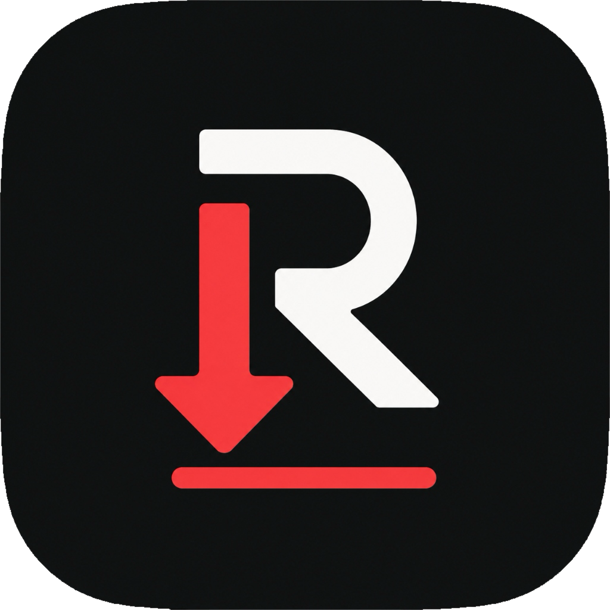

# Retrazo 🎬

<p align="center">
  
</p>

<p align="center">
  <strong>A clean, native macOS frontend for <a href="https://github.com/yt-dlp/yt-dlp">yt-dlp</a> built in Swift.</strong>
</p>

---

## ✨ Features

- **🚀 Native & Fast**: Built in 100% Swift & SwiftUI with a modern macOS design (glassmorphic sidebar, SF Symbols, smooth animations).
- **🔄 Built-In yt-dlp Auto-Updater**:
  - Automatically or manually checks GitHub Releases for the latest version of `yt-dlp`.
  - Downloads and maintains its own standalone macOS binary in `~/Library/Application Support/Retrazo/bin/yt-dlp` or auto-detects existing Homebrew / system installations.
  - One-click in-app update with live release notes inspector.
- **📦 Retrazo App Updates from GitHub**:
  - Checks this repository's GitHub Releases automatically or from **Retrazo > Check for Retrazo Updates**.
  - Downloads `Retrazo-macOS.zip`, verifies its GitHub SHA-256 digest when available, validates the bundle identity and code signature, then installs and relaunches the app.
- **🎥 Full Video & Audio Support**:
  - High resolutions: 8K (4320p), 4K (2160p), 1440p, 1080p, 720p, 480p (MP4, MKV, WebM, MOV).
  - Audio extraction: MP3 (up to 320k), M4A, FLAC (lossless), WAV, OPUS, AAC.
- **📋 Smart Queue & URL Detection**:
  - Concurrent download queue with real-time speed (`MB/s`), progress percentage, downloaded/total size, and ETA.
  - Automatically detects media URLs on the macOS clipboard.
- **📑 Playlists & Custom Ranges**:
  - Download entire playlists or specify custom item ranges (e.g. `1-10`, `5, 8-12`).
- **💬 Subtitles & Metadata**:
  - Embed subtitles or download external tracks (.srt / .vtt) in multiple languages.
  - Embed thumbnail artwork, video metadata, and chapter markers into media files.
- **🛡️ SponsorBlock & Privacy**:
  - Skip and remove sponsored segments, intros, outros, and self-promotions.
  - Extract cookies from Safari, Chrome, Firefox, Brave, Edge, or specify a custom `cookies.txt` file for private / age-restricted media.
- **💻 Live CLI Log Inspector**:
  - Terminal-style live log viewer for every task to inspect raw `yt-dlp` stdout/stderr and troubleshoot any issues.
- **⚡ Power-User Custom Arguments**:
  - Add custom `yt-dlp` flags per-download or globally in Settings.

---

## 🛠️ Building the App (No Xcode GUI Required)

Retrazo is built with standard **Swift Package Manager (SPM)** and can be compiled and packaged directly from the command line or on GitHub Actions.

### Prerequisites
- macOS 13.0 (Ventura) or newer
- Swift 5.9+ (included with Apple Command Line Tools or Xcode)

### Quick Build & Run

1. **Make scripts executable**:
   ```bash
   chmod +x scripts/*.sh
   ```

2. **Generate the App Icon (`AppIcon.icns`)**:
   ```bash
   ./scripts/generate_icon.sh
   ```

3. **Build the `.app` bundle**:
   ```bash
   ./scripts/build_app.sh
   ```
   This will compile the release binary and generate `build/Retrazo.app` and `build/Retrazo-macOS.zip`.

4. **(Optional) Create a DMG installer**:
   ```bash
   ./scripts/create_dmg.sh
   ```
   This creates `build/Retrazo-macOS.dmg` ready for distribution.

5. **Launch Retrazo**:
   ```bash
   open build/Retrazo.app
   ```

---

## 🚀 GitHub Actions CI/CD

A complete GitHub Actions workflow is provided in [`.github/workflows/build.yml`](.github/workflows/build.yml).

- **Automated Builds**: Runs on every push and pull request to `main`.
- **Automatic Releases**: When you push a version tag (e.g. `git tag v1.0.0 && git push origin v1.0.0`), GitHub Actions compiles the app on a macOS runner, packages `Retrazo-macOS.dmg` and `Retrazo-macOS.zip`, and automatically attaches them to a new GitHub Release.
- The tag determines the app version embedded in `Info.plist`. Use a new semantic version tag for every update, such as `v1.1.0` and then `v1.1.1`.

---

## ⚙️ yt-dlp & FFmpeg Setup

Retrazo is designed to work out-of-the-box:
1. When launched, Retrazo checks for `yt-dlp`. If not found, open **Settings > Engine & Updates** and click **Install yt-dlp** to download the latest binary directly into the app's application support directory.
2. For high-resolution video merging and audio conversion, FFmpeg is recommended:
   ```bash
   brew install ffmpeg
   ```
   Or specify a custom FFmpeg binary path in **Settings**.

---

## 📄 License

MIT License. See LICENSE for details.
`yt-dlp` is developed and maintained by the [yt-dlp team](https://github.com/yt-dlp/yt-dlp).
